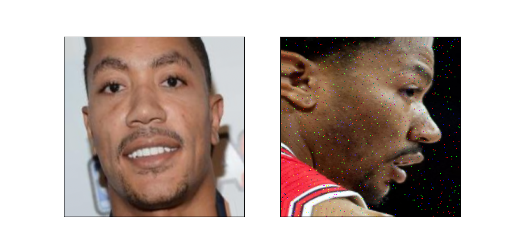
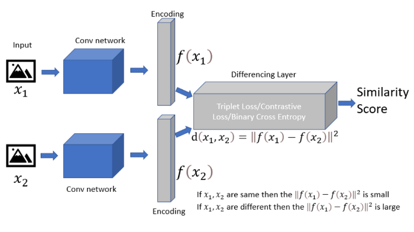

# Human Face Verification with One-shot Learning Using Siamese Neural Network
A Siamese neural network (sometimes called a twin neural network) is an artificial neural network that uses the same weights while working in tandem on two different input vectors to compute comparable output vectors [[From WIKI]](https://en.wikipedia.org/wiki/Siamese_neural_network). In the modern Deep learning era, Neural networks are almost good at every task, but these neural networks rely on more data to perform well. But, for certain problems like face recognition and signature verification, we can’t always rely on getting more data, to solve this kind of task we have a new type of neural network architecture called Siamese Networks. It uses only a few numbers of images to get better predictions. The ability to learn from very little data made Siamese networks more popular in recent years [[From Towards Data Science]](https://towardsdatascience.com/a-friendly-introduction-to-siamese-networks-85ab17522942). This repository contains my solution to human face verification with [One-shot learning](https://en.wikipedia.org/wiki/One-shot_learning) using siamese neural network. The dataset used for this problem is the [Celebrities in Frontal-Profile in the Wild (CFPW dataset)](http://www.cfpw.io/).

### Required Package
This project requires **Python** and the following Python packages:
- [NumPy](https://www.numpy.org/)
- [matplotlib](https://matplotlib.org/)
- [seaborn](https://seaborn.pydata.org/)
- [TensorFlow](https://www.tensorflow.org/)
- [OpenCV](https://opencv.org/)
- [scikit-learn](https://scikit-learn.org/stable/)
- [os](https://docs.python.org/3/library/os.html)

If you do not have Python installed yet, it is highly recommended that you install the [Anaconda](https://www.anaconda.com/) distribution of Python, which already has most of the above packages. 

### Splitting CFPW dataset
[CFPW dataset](http://www.cfpw.io/) contains images of celebrities in frontal and profile views. There are 500 celebrities' images in 500 folders. All of the folders have 10 frontal view images and 4 profile view images, so a total of 14 images are in each and every folder. For training the siamese neural network I randomly choose 350 folders and for the validation set, I randomly choose 100 folders and, the rest of the 50 folders were kept for the test set. The test set remained isolated the whole time, I just it at last just to verify if my model has accuracy in the out-of-sample examples.

### Short Description of Each Source Code File
1. **siamese_augmentation.py**- As the input in the siamese network needs to be given as duplets of positive examples (same class) or negative examples (different class), I was unable to use the Keras image augmentation method. So, I wrote the **siamese_augmentation.py** file. This file and its function are responsible for the augmentation of the input duplets in the training data. Example of a positive duplet image. 

  

2. **siamese_function.py**- This file is responsible for creating duplets from the data. First of all image folders are randomly sampled from the data. Then the sampled folder images are loaded in the NumPy array. Images are loaded in RGB format. From the image data, it will generate batches of positive duplets and negative duplets continuously. This file is also responsible for the visualization of duplets, if necessary.

3. **siamese_model.py**- The siamese network I used have almost 13M trainable parameter. The CNN architecture used in this repository is similar to the [VGG16](https://arxiv.org/pdf/1409.1556.pdf) but the model I used has less trainable params(13M) compared to the original VGG16(138.4M) model and the model I used also have BatchNormalization layers for regularization purposes. Written in [this medium article](https://medium.com/swlh/siamese-network-for-facial-recognition-5bd33be9e381) about siamese network and visualizing its general architecture. 

>"Siamese Network is a One-shot classifier with two mirror-image subnetworks to rank similarity or dissimilarity between the two inputs using Similarity score."

  

4. **siamese_testdata.py**

5. **siamese_enroll.py**
